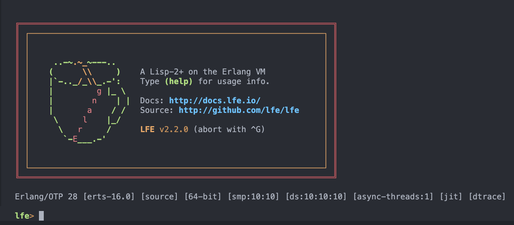

# rebar3_lfe

[![Build Status][gh-actions-badge]][gh-actions]
[![LFE Versions][lfe-badge]][lfe]
[![Erlang Versions][erlang-badge]][versions]
[![Tag][github-tag-badge]][github-tag]
[![Downloads][hex-downloads]][hex-package]

[![Project Logo][logo]][logo-large]

*A modern rebar3 plugin for LFE projects*

## ✨ Why rebar3_lfe?

* **🚀 Fast**: Incremental compilation is 10-30x faster than full rebuilds
* **🎯 Correct**: Header changes automatically trigger recompilation
* **🛡️ Reliable**: >90% test coverage, tested on Erlang/OTP 25-29
* **📦 Powerful**: Nested module packages with proper cleanup
* **💬 Clear**: Professional error messages that help you fix issues
* **🔧 Modern**: Uses rebar3's latest compiler infrastructure

## Quick Start

```erlang
%% rebar.config
{plugins, [
    {rebar3_lfe, "~> 0.5"}
]}.

{deps, [
    {lfe, "~> 2.0"}
]}.
```

```bash
rebar3 lfe compile    # Compile your code
rebar3 lfe repl       # Start REPL
rebar3 lfe eval '(+ 1 2 3)'  # Evaluate LFE expressions
rebar3 lfe ltest      # Run tests
rebar3 lfe format     # Format your source
```

**[See Full Quick Start →](docs/quickstart.md)**

## Features

### 🔥 Smart Compilation

```bash
$ rebar3 lfe compile
Compiling 10 LFE files...
Progress: 10/10 (100%)
Compiled 10 files in 1.25s

$ touch include/records.lfe
$ rebar3 lfe compile
Compiling 3 LFE files...  # Only files using the header
Compiled 3 files in 0.3s
```

### 🤖 Updated REPL

REPL support in rebar3_lfe has changed slightly in 0.5.0:

* Easier support for customising the LFE REPL prompt
* `rlwrap` for more consistent experience with readline support (dedicated LFE history file, etc.)

There is a new `Makefile` target that is included with all generated projects (`rebar3 new lfe-*`) which makes it easier for projects to use rlwrap and prompt customisations:

```
make repl
```

[](priv/images/screenshot-repl.png)

Autocompletion support is currently in progress; when complete, example usage will be shown here.

### 📦 Package System

Optional!

Organize your code by directories:

```
src/
├── myapp.lfe           → myapp module
└── myapp/
    ├── core.lfe        → myapp.core module
    └── utils/
        └── helpers.lfe → myapp.utils.helpers module
```

### 🎨 Great Errors

```
src/myapp.lfe:10: error: undefined function foo/1
  Did you mean: bar/1?
```

### 📐 Consistent Formatting

`rebar3 lfe format` reformats your LFE source to the LFE style conventions
(80-column width, 2-space indentation, the `lfe-indent.el`-derived special-form
table), **preserving every comment**. It is idempotent and token-preserving.
`export`/`import` entries are sorted alphabetically one-per-line (sort suppressed
when an entry carries a comment). By default it edits files in place; `--dry-run`
prints the result to stdout instead, and `--check` makes it a CI gate.

**Format in place** (the default — files are rewritten):

```bash
rebar3 lfe format                     # every .lfe file in the configured source dirs
rebar3 lfe format --path src/sub      # only this directory (recursively)
rebar3 lfe format --path src/foo.lfe  # only this file
```

**Dry run** (no files changed — formatted output goes to stdout; over multiple
files, each is preceded by a `;; ==> <path>` header):

```bash
rebar3 lfe format --dry-run                     # whole project, to stdout
rebar3 lfe format --dry-run --path src/sub      # one directory, to stdout
rebar3 lfe format --dry-run --path src/foo.lfe  # one file, to stdout
```

**Check** (no files changed — exits non-zero and lists any files that are not
already formatted; ideal for CI):

```bash
rebar3 lfe format --check
```

Without `--path`, `format` operates on the source directories configured in
`rebar.config` (`src_dirs`), defaulting to `src/`.

### ⚡ All the Commands

**Core:**

* `compile` - Smart, incremental compilation
* `clean` - Remove build artifacts
* `format` - Format LFE source (in place, `--dry-run`, or `--check`)
* `repl` - Interactive LFE shell
* `eval` - Evaluate LFE expressions
* `ltest` - Run tests
* `versions` - Version information

**Scripts & Escripts:**

* `run` - Execute LFE scripts (main/1)
* `escriptize` - Build standalone executables
* `run-escript` - Execute built escripts

**Releases:**

* `release` - Build OTP releases
* `run-release` - Manage releases (start/stop/console/etc)

**Utilities:**

* `confabulate` - Convert Erlang data to LFE format
* `defabulate` - Convert LFE data to Erlang format

**[See All Commands →](docs/commands.md)**

## Documentation

* **[Quick Start](docs/quickstart.md)** - Get started in 5 minutes
* **[Commands](docs/commands.md)** - Complete command reference
* **[Troubleshooting](docs/troubleshooting.md)** - Common issues
* **[Migration Guide](docs/0.4-to-0.5-migration.md)** - Upgrade from 0.4.x

## Compatibility

| Erlang/OTP | rebar3  | lfe/rebar | Status    |
|------------|---------|-----------|-----------|
| 29         | 3.27    | 0.5.x  | ✅ Tested |
| 28         | 3.27    | 0.5.x  | ✅ Tested |
| 27         | 3.27    | 0.5.x  | ✅ Tested |
| 26         | 3.27    | 0.5.x  | ✅ Tested |
| 25         | 3.24    | 0.5.x  | ✅ Tested |

## Breaking Changes from 0.4.x

Version 0.5.0 is a **complete rewrite** with breaking changes:

* Module prefix: `rebar3_lfe_*` → `r3lfe_*`
* Faster, more reliable compilation
* Better error messages

**[Migration Guide →](./docs/0.4-to-0.5-migration.md)**

## Contributing

See [contributing](./docs/contributing.md).

```bash
git clone https://github.com/lfe/rebar3.git rebar3_lfe
cd rebar3_lfe
rebar3 compile
make check
```

## Support

* **Documentation**: [lfe.github.io/rebar3](https://lfe.github.io/rebar3)
* **Issues**: [GitHub Issues](https://github.com/lfe/rebar3/issues)
* **Discussions**: [GitHub Discussions](https://github.com/lfe/rebar3/discussions)
* **Chat**: `#tooling` in [LFE Discord](https://discord.gg/Uf3PszVHtF)

## License

Apache 2.0 - See [LICENSE](LICENSE)

---

[logo]: https://avatars2.githubusercontent.com/u/15242004?s=250
[logo-large]: https://avatars2.githubusercontent.com/u/15242004
[gh-actions-badge]: https://github.com/lfe/rebar3/workflows/CI%2FCD/badge.svg
[gh-actions]: https://github.com/lfe/rebar3/actions
[lfe]: https://github.com/lfe/lfe
[lfe-badge]: https://img.shields.io/badge/lfe-2.x-blue.svg
[erlang-badge]: https://img.shields.io/badge/erlang-25+-blue.svg
[versions]: https://github.com/lfe/rebar3/blob/release/0.5.x/.github/workflows/ci.yml
[github-tag]: https://github.com/lfe/rebar3/tags
[github-tag-badge]: https://img.shields.io/github/tag/lfe/rebar3.svg
[hex-package]: https://hex.pm/packages/rebar3_lfe
[hex-downloads]: https://img.shields.io/hexpm/dt/rebar3_lfe.svg
