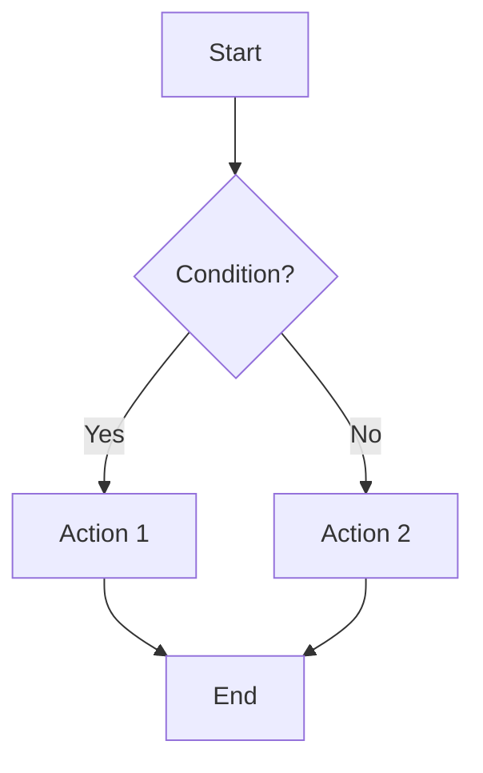

# rebar3 Erlang Compilation Chain Documentation Prompt

## Objective

You need to create comprehensive documentation of the entire Erlang compilation chain in rebar3. This documentation will serve as the canonical reference for auditing compiler plugins (specifically rebar3_lfe), so completeness and accuracy are critical.

## Scope of Analysis

### 1. Complete Compilation Chain Coverage

Examine and document the **entire** Erlang compilation process, including but not limited to:

- **Primary compilation path**: `.erl` source files → `.beam` bytecode
- **Application metadata**: `app.src` → `app` file generation and processing
- **Include files**: `.hrl` header files and their handling
- **OTP applications**: Application resource files and metadata
- **OTP releases**: Release-based projects with multiple applications in `apps/` directory
- **Dependencies**: How the entire compilation chain applies recursively to dependencies
- **Parse transforms**: Handling of parse_transform modules and their compilation order
- **Behaviors**: Special handling for behavior modules
- **NIFs and Port Drivers**: C/C++ compilation integration (if applicable)
- **YECC/LEEX**: Parser and lexer generator files (`.yrl`, `.xrl`)
- **ASN.1 files**: `.asn1` file compilation
- **MIBs**: SNMP MIB file compilation
- **Any other file types** processed during the build chain

### 2. Configuration and Options

Document all configuration mechanisms and their precedence:

- **rebar.config**: Project configuration
- **rebar.lock**: Dependency locking
- **sys.config**: System configuration
- **vm.args**: VM arguments
- **Environment variables**: Any env vars that affect compilation
- **CLI flags**: Command-line arguments and options
- **Profiles**: How profiles (default, test, prod, custom) modify behavior
- **Option precedence rules**: CLI → profile → rebar.config → defaults

### 3. State and Context Management

Document how state flows through the system:

- **rebar_state**: What's stored, when it's updated, how it's passed
- **rebar_app_info**: Application-level state and metadata
- **Build artifacts**: What gets written where and when
- **Caching mechanisms**: What gets cached, invalidation rules
- **Dependency graph**: How dependencies between modules/apps are tracked

### 4. Error Handling and Edge Cases

Document error handling at each stage:

- **Compilation errors**: How they're detected, reported, and handled
- **Missing dependencies**: Detection and resolution
- **Circular dependencies**: How they're detected and handled
- **Invalid configuration**: Validation and error messages
- **Recovery mechanisms**: Fallback behaviors and partial compilation
- **Warnings vs. Errors**: How warnings are configured and treated

### 5. Hook System and Provider Architecture

Document the plugin/provider architecture:

- **Provider lifecycle**: Registration, dependencies, execution
- **Pre-hooks and post-hooks**: Where they fire and what they can modify
- **Provider dependencies**: Execution order determination
- **Namespace handling**: How providers are organized and invoked
- **Custom providers**: How third-party providers integrate

### 6. Incremental Compilation

Document how rebar3 optimizes rebuilds:

- **Change detection**: How rebar3 determines what needs recompilation
- **Source-to-artifact mapping**: Tracking which sources produce which outputs
- **Dependency tracking**: Inter-module dependencies for recompilation
- **Timestamp vs. hash checking**: What mechanism is used and when
- **Forced rebuilds**: When and why full recompilation occurs

### 7. Path and Directory Management

Document all path handling:

- **Source directories**: Where source files are found
- **Output directories**: `ebin/`, `priv/`, etc.
- **Include paths**: How `-I` paths are constructed
- **Code paths**: How the Erlang code path is managed during compilation
- **Temporary directories**: Any temporary files or directories used

## Documentation Structure

### Phase 1: High-Level Flow Document

Create a **single comprehensive overview document** named `00_rebar3_compile_chain_overview.md` that:

- Provides a bird's-eye view of the entire compilation process
- Uses a clear narrative structure (not implementation details)
- Names each major stage/phase of compilation with descriptive names
- Shows the flow and conditional branches at a high level
- **Includes a Mermaid flowchart** showing the major stages and decision points
- Does NOT include function names, module names, or implementation details
- Focuses on WHAT happens, not HOW it's implemented

**Example stage names (illustrative):**
- "Dependency Resolution Phase"
- "Application Discovery"
- "Source File Compilation"
- "Application Resource File Generation"
- "Release Assembly"

### Phase 2: Detailed Technical Documents

For **each stage/phase** identified in the overview document, create a separate focused technical document named `NN_[stage_name].md` where NN is a sequence number (01, 02, etc.).

Each technical document must include:

#### Required Sections

1. **Stage Overview**
   - Purpose of this stage
   - When it executes in the overall chain
   - Prerequisites (what must complete before this stage)
   - Outputs (what this stage produces)

2. **Execution Flow**
   - Detailed step-by-step process
   - All conditional branches and decision points
   - Mermaid flowchart of the stage's internal flow

3. **API Calls and Functions**
   - Every rebar3 API function called in this stage
   - Function signatures with full type information
   - Purpose of each call
   - Arguments passed (with their types and typical values)
   - Return values and their types

4. **State Modifications**
   - What state is read
   - What state is written/modified
   - State structure details (relevant fields)

5. **Configuration**
   - All configuration options affecting this stage
   - Option types and valid values
   - Default values
   - How options interact or override each other

6. **File System Operations**
   - Files read (with paths)
   - Files written (with paths)
   - Directories created
   - Temporary files used

7. **Error Conditions**
   - All error cases that can occur
   - How each error is detected
   - Error messages generated
   - Recovery or fallback behavior

8. **Edge Cases**
   - Special scenarios or unusual inputs
   - How they're handled differently

9. **Cross-References**
   - Links to other stages this stage depends on
   - Links to stages that depend on this stage
   - Shared utilities or common patterns

10. **Example Scenarios**
    - Concrete examples of this stage processing typical inputs
    - Show what happens with specific configurations

## Output Requirements

### File Organization

```
rebar3_compile_chain_documentation/
├── 00_rebar3_compile_chain_overview.md
├── 01_[first_stage_name].md
├── 02_[second_stage_name].md
├── 03_[third_stage_name].md
└── ... (one file per stage)
```

### Documentation Standards

- Use **consistent Markdown formatting**
- Use **code blocks** with language specification for all code examples
- Use **tables** for configuration options, function signatures, and structured data
- Use **Mermaid diagrams** for flows (both in overview and individual stages)
- Use **bold** for emphasis on critical points
- Use **internal links** between documents (e.g., `[Dependency Resolution](01_dependency_resolution.md)`)
- Include a **table of contents** in longer documents
- Keep paragraphs focused and concise

### Mermaid Diagram Requirements

For flowcharts, use this style:



### Function Documentation Format

When documenting API calls, use this format:

```markdown
#### `function_name/arity`

**Purpose**: Brief description of what this function does

**Signature**:
```erlang
-spec function_name(Arg1Type, Arg2Type) -> ReturnType.
```

**Arguments**:
- `Arg1` (`Arg1Type`): Description of first argument
- `Arg2` (`Arg2Type`): Description of second argument

**Returns**: Description of return value

**Example Usage**:
```erlang
Result = function_name(State, Options)
```

**Called From**: [Stage Name](02_stage_name.md)
**Calls To**: Other functions this calls (if significant)
```

## Critical Requirements

1. **Completeness**: Document EVERYTHING. This will be used to verify plugin correctness, so missing information could lead to incorrect implementations.

2. **Accuracy**: All function signatures, types, and behaviors must be accurate. Verify against the actual rebar3 source code.

3. **Clarity**: Write for someone who needs to implement a compatible plugin. They should be able to recreate the behavior from your documentation.

4. **Structure**: Follow the specified structure exactly. Consistency across documents is crucial.

5. **Cross-referencing**: Liberally link between related sections and documents.

6. **No assumptions**: Don't assume the reader knows anything about rebar3 internals. Explain everything.

## Verification Checklist

Before considering the documentation complete, verify:

- [ ] All file types processed by rebar3 are documented
- [ ] All configuration options are documented with types and defaults
- [ ] All stages have conditional branches fully mapped
- [ ] All rebar3 API calls are documented with signatures
- [ ] Error handling is documented for each stage
- [ ] State flow is clear from stage to stage
- [ ] Provider/hook system is fully explained
- [ ] Incremental compilation logic is documented
- [ ] Path resolution is documented for all file types
- [ ] Dependencies are handled (compilation of dep sources)
- [ ] All Mermaid diagrams render correctly
- [ ] All internal links work correctly
- [ ] Examples are provided for complex scenarios

## Notes for Implementation

- Start by reading through the rebar3 source code to identify all stages
- Focus on the `compile` command and its providers
- Pay special attention to `rebar_prv_compile.erl` and related modules
- Examine `rebar_state` and `rebar_app_info` modules for state structure
- Look at test cases for edge cases and examples
- Consider using `git grep` to find all file types and extensions handled

## Success Criteria

The documentation is complete when:

1. A plugin author could implement a compatible compiler plugin using only this documentation
2. All edge cases and error conditions are covered
3. The execution flow is clear from start to finish
4. An auditor could verify another plugin's correctness against this reference
5. No implementation details are missing that would affect observable behavior

---

**Remember**: This documentation will be used to audit the rebar3_lfe plugin implementation. Thoroughness and accuracy are paramount. When in doubt, include more detail rather than less.
